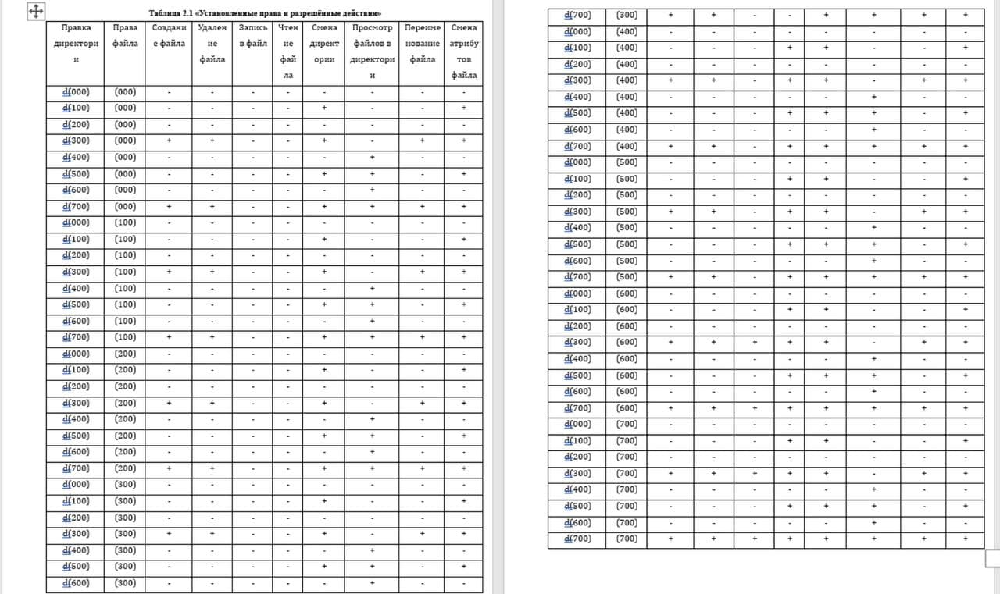

---
## Front matter
lang: ru-RU
title: Лабораторная работа №2. Дискреционное разграничение прав в Linux. Основные атрибуты.
author: Захарова Софья Михайловна

## Formatting
toc: false
slide_level: 2
theme: metropolis
mainfont: PT Serif 
romanfont: PT Serif
sansfont: PT Sans
monofont: PT Mono
header-includes: 
 - \metroset{progressbar=frametitle,sectionpage=progressbar,numbering=fraction}
 - '\makeatletter'
 - '\beamer@ignorenonframefalse'
 - '\makeatother'
aspectratio: 43
section-titles: true
---
# Цель работы

Получение практических навыков работы в консоли с атрибутами файлов, закрепление теоретических основ дискреционного разграничения доступа в современных системах с открытым кодом на базе ОС Linux.

---
# Задание

Лабораторная работа подразумевает работу с виртуальной машиной VirtualBox, операционной системой Linux, дистрибутивом Centos и закрепление теоретических основ дискреционного разграничения доступа.

---
# Выполнение лабораторной работы

1. В установленной при выполнении предыдущей лабораторной работы операционной системе создаем учётную запись пользователя guest.И задаем для нее пароль.

{ #fig:001 width=50% }

---

2. Входим в систему от имени пользователя guest.

{ #fig:002 width=50% }

---

3. Определяем директорию, в которой находимся, командой pwd и заходим в домашнюю директорию. 

{ #fig:003 width=50% }

---

4. Уточняем имя пользователя командой whoami.

{ #fig:004 width=50% }

---

5. Уточняем данные пользователя командой id. Сравниваем вывод id с выводом команды groups.

{ #fig:005 width=50% }

---

6. Просматриваем файл /etc/passwd командой cat /etc/passwd. 

{ #fig:006 width=50% }

---

7. Находим свою учётную запись. Определяем uid пользователя. Определяем gid пользователя. Сравниваем найденные значения с полученными в предыдущих пунктах.Они овпадают.

{ #fig:007 width=50% }

---

8. Определяем существующие в системе директории командой ls -l /home/. Команда выполнилась, у нас оказалось достаточно прав.

{ #fig:008 width=50% }

---

9. Проверяем, какие расширенные атрибуты установлены на поддиректориях, находящихся в директории/home, командой: lsattr /home. Здесь нам отказано в доступе.

{ #fig:009 width=50% }

---

10. Создаем в домашней директории поддиректорию dir1 командой mkdir dir1.

{ #fig:010 width=50% }

---

11. Проверяем права и атрибуты для этой директории.

{ #fig:011 width=50% }

---

12. Снимаем все атрибуты с этой директории.

{ #fig:012 width=50% }

---

13. Попытка создания файла. Отказано в достпе.

{ #fig:013 width=50% }

---

14. Проверяем, действительно ли файл не создан. Отказано в доступе.

{ #fig:014 width=50% }

---

15. Заполняем таблицу установленных прав и разрешенных действий.

{ #fig:015 width=50% }

---

16. Заполняем таблицу минимально необходимых прав.

{ #fig:016 width=50% }

---
# Выводы

В результате выполнения данной лабораторной работы я получила практические навыки работы в консоли с атрибутами файлов, закрепила теоретические основы дискреционного разграничения доступа в современных системах с открытым кодом на базе ОС Linux.

---

## {.standout}

Спасибо за внимание!
